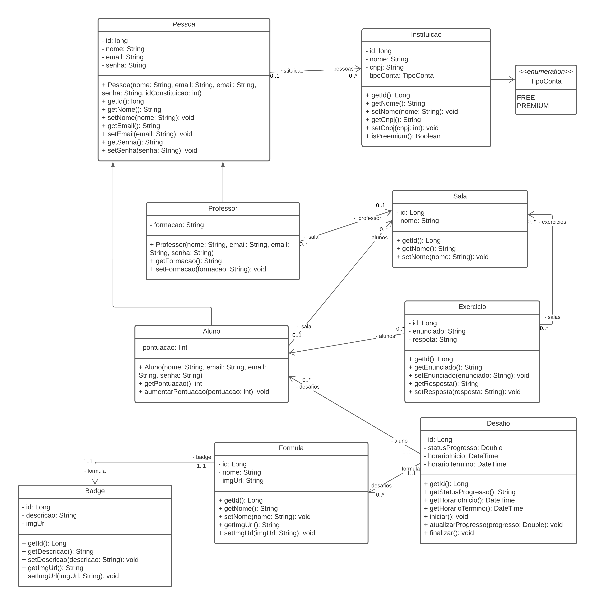

# Produtos Montáveis - Diagramas

## Modelo de Negócio

---

## Arquitetura do Sistema

## Arquitetura Cliente/Servidor

---

## Mapa de site

## Web

## Mobile

---

## Diagramas Entidade Relacionamento

### Exercício

### Desafio

---

## Diagrama de Classes

---

## Diagramas de Atividade

---

## Casos de Uso

